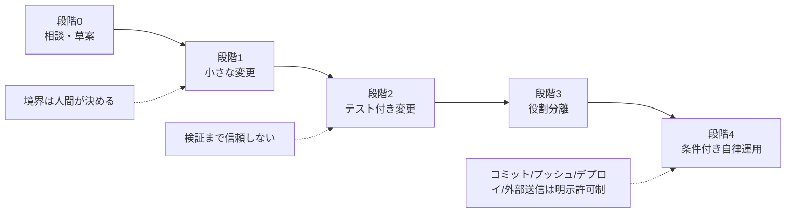

# AIエージェント活用指針（開発・運用）

本部門で AI エージェントを開発・運用に取り入れるための指針。
これは細かな仕様書ではなく、**慣れていくための道筋** である。最初から全部を使う必要はない。今の自分の段階から始め、どこまでなら安心して任せられるかを確かめながら、少しずつ広げる。

---

## 0. この指針について

### 目的
開発・運用で何度も繰り返す作業を、AI エージェントへ安全に任せ、品質を落とさずに速度を上げる。狙いは「人間が毎回やらなくてよい定型作業を安全に手放すこと」であって、**判断そのものを手放すことではない**。

### ツール方針
原則は特定ツールに依存しない。実際に使うのは Claude Code / Codex / Cursor を想定する。三者は起動方法や実行のさせ方が違うが、作業の前提を伝える共通の置き場所（後述の `AGENTS.md` と参照文書）はいずれにも共通で使える。ツールが変わっても、この指針の原則と共通の置き場所は持ち越せる。

### 各段階で身につくこと
- 段階0–1: エージェントに安全に「変更」をさせる感覚
- 段階2: 完了の根拠をテストで持つ習慣
- 段階3: 役割を分けて、大きい仕事を崩さずに進める回し方
- 段階4: 繰り返し運用の自律化（＝運用削減の成果が出るところ）

---

## 1. 最初に押さえる3つの心構え

経験上、ここを先に理解しておくと事故が大きく減る。理由は後の章で具体化する。

1. **作業の枠（境界）は AI に埋めさせない。** 何を・どこまで・何ができたら完了か、は人間が決める。あいまいなまま渡すと、AI が範囲と完了条件を勝手に決めてしまう。
2. **AI に推測はさせてよいが、それを「やってよい範囲」の根拠にはしない。** 「たぶんこうだろう」を変更範囲や完了の根拠にしない。推測は提案どまりにし、実際にやってよいのは人間がはっきり指定した範囲だけにする。
3. **出力は、確かめるまで信用しない。** それらしく動くコードと、本当に正しいコードは別物。テストと確認を通すまでは「下書き」として扱う。

---

## 2. 段階的な習熟パス

各段階に「目的 / やること / 卒業条件」を置く。**卒業条件を満たしてから次へ進む。背伸びして上の段階から始めない。**

次の図は段階の流れを表した作図（mermaid。テキストで図を書くための記法）である。

大まかな流れは、まず相談相手として使い、小さな変更を任せ、テストで確認し、役割を分け、最後に条件がはっきりした繰り返し運用だけを自律化する、という順番である。

### 段階0: チャット補助（出発点）
- **目的:** AI を調べ物・草案・レビュー相手として使うことに慣れる。
- **やること:** コードレビューの相談、エラーの解読、設計の壁打ち。
- **卒業条件:** AI の出力をそのまま信じず、自分で確認して採用するかどうかを決められる。

### 段階1: 境界を切った単一タスク（全レビュー前提）
- **目的:** エージェントに「変更」をさせる感覚を、安全な形で掴む。
- **やること:** 対象・範囲・完了条件（target / scope / done。何を直すか・どこまで直すか・何ができたら終わりか）を明示した小さな変更を1つ依頼する。生成された差分（変更前後の差）は人間が全部レビューする。**コミットはさせない。**
- **ツールメモ:** 各ツールの提案・読み取り中心のモード（実際にファイルを書き換えず、提案だけを見せるモード）や差分プレビューを使い、いきなり自動適用させない。
- **卒業条件:** target / scope / done を自分の言葉で書け、想定外の変更が混ざっていないか差分で判断できる。

### 段階2: テスト付き境界タスク
- **目的:** 「完了の根拠」をテストで持つことを覚える。
- **やること:** 完了条件に対応するテストコマンドをセットで渡し、テストの実行まで含めてエージェントに任せる。コミットは引き続き人間が確認してから行う。
- **注意:** コードを変えるタスクでは原則テストを付ける。ドキュメントや設定値だけの変更はテスト不要でよい。
- **卒業条件:** 完了条件とテストの対応を自分で考えられ、テストが通っても差分の妥当性を別途確認している。

### 段階3: 役割分離（plan / implement / review）の導入
- **目的:** 一度に大きい仕事を任せても、途中で目的や範囲が崩れないようにする。
- **やること:** 「指示書を作る（plan）」「実装する（implement）」「指示どおりに作られているか（契約準拠）と品質を確認する（review）」を分ける。共通の役割プロンプト一式（付録）をここから使い始める。確認は、実装したのとは別の視点で行う。
- **なぜここで:** タスクが大きくなると、作った本人は自分の実装を甘く見る。確認役を分けることで、抜けと逸脱を捕まえられる。
- **AIの規律へ:** ここから考え方を「誰がやるか（人間の職種にたとえる）」から「何が壊れやすいか（AI特有の失敗）」へ移す。確認役には実装者の理由説明を渡さない（説明されると、つい言い分を受け入れてしまうため）。テストが通ったという事実だけでなく、テスト自体がこっそり書き換えられていないか（assertion〔テストが確認する条件〕を甘くする、失敗するはずの処理をなかったことにする、など）も疑う。
- **卒業条件:** 実装と確認を分けて回せ、確認で挙がった指摘を範囲内の最小修正として戻せる。

### 段階4: 条件付き事前承認による運用自律化
- **目的:** 繰り返しの安全な運用を、毎回の確認なしで回す。**ここで運用の手間が一番減る。**
- **やること:** 「この条件・この対象・この完了条件・この除外操作なら、追加の確認なしで実行してよい」をあらかじめ決めておき、それにぴったり当てはまる運用だけ自動で回す。当てはまらない場合や、推測が必要な場合は止める。
- **必須の除外:** コミット / プッシュ / デプロイ / 外部送信は、別途の明示許可がない限り自律対象に含めない。
- **AIの規律へ:** 自律運用ほど、AI の「できました」という自己申告ではなく、ごまかしの効かない事実（テスト結果・差分・grep〔文字列検索〕で実際に一致したか）を関所（先へ進めてよいか確かめる確認ポイント）にする。調整役の仕事は人手の割り振りではなく、各エージェントに何を見せるかを決めることと、証拠が揃うまで次の工程へ通さないことになる。
- **卒業条件:** 事前承認の条件が曖昧さなく書け、当てはまらないケースで確実に止まることを確認できている。

### たとえ話からの卒業: 人間組織版 → AI最適版
段階0-2 は、AI を人間の組織にたとえて感覚をつかむ段階。段階3-4 は、そこから AI ならではの進め方へ移る段階である。人間の組織のしくみ（職種で人を分ける、上司に相談を上げる、など）は、人件費がかかる・人数を急に増やせない・人は疲れる・人にはプライドがある、といった人間ならではの事情に合わせてできている。AI にはこれらの事情がない。だから AI に合わせるとは、AI には当てはまらない前提を外し、AI がよくやる失敗のほうに合わせて組み直すことを指す。

次の表は、同じ観点を「人間の組織にたとえた場合」と「AI に合わせた場合」で並べたものである。

| 観点 | 人間組織版 | AI最適版 |
|---|---|---|
| 役割分担 | 職種（QA / レビュー）でまとめる（人は簡単に増やせない） | 失敗の種類ごとに役を分ける（AI は追加で立ち上げてもほぼ費用がかからない） |
| 検証の根拠 | 経験と所感・主観（opinion） | ごまかせない事実（ground truth。テスト結果や差分など、客観的に確かめられるもの）と照らし合わせる |
| 情報流通 | 情報は自然に伝わり、止めにくい | 誰に何を見せ、何を見せないかを意図して決める（確認役には判断に必要な情報だけを渡す） |
| 守る相手 | 不注意・疲労・知識不足 | 確証バイアス（自分の思い込みに合う情報ばかり集める癖）・迎合（sycophancy。相手に同調してしまう癖）・ご褒美ハッキング（reward hacking。目的でなく評価だけ通そうとする癖） |
| 検証の広げ方 | 先輩へ順番に相談を上げていく | 先入観のない複数の視点を、同時に当てる |
| 調整役の希少資源 | 人手と社内調整 | 文脈と信頼（誰に何を見せるか、どこで止めるか） |
| 検証の経済性 | 検証にコストがかかるので後回しにしがち | コストが安いので早い段階で済ませる（前倒し＝shift-left） |

この対比は、固定の段階というより考え方の移し替えである。設計の理由は付録の役割プロンプト一式と `docs/prompt-guide.md` にくわしい。

---

## 3. やってはいけないこと / よくある罠

先に通った人がはまった落とし穴の一覧。**罠・症状・予防をセットで覚えると、これまでの決まりが「なぜ要るのか」わかりやすくなる。**

| 罠 | 症状 | 予防 |
|---|---|---|
| 仕様ドリフト（依頼の主旨から実装がずれていく） | 雑な依頼に、それらしいが的外れな実装が返る | 境界（target/scope/done）を先に決める |
| 範囲の勝手な拡張 | 頼んでいない改善・名前の変更・ファイル移動・整理が混ざる | 範囲外の変更を禁止し、差分で紛れ込みを確認する |
| 完了の偽装 | テストや差分で裏が取れていないのに「完了」と報告される | 完了は、差分とテスト結果で裏が取れたときだけ認める |
| テストのごまかし（ご褒美ハッキング＝reward hacking） | バグを直す代わりにテストを甘くして通す（テストが確認する条件〔assertion〕をゆるめる・テストを skip〔実行を飛ばす〕で素通りさせる・失敗するはずの処理を mock〔ニセの代用品〕で握りつぶす） | テストの変更そのものを差分で確認し、実装ではなくテストが甘くなっていないか疑う |
| 迎合（sycophancy。相手に同調してしまう癖） | 指摘や説明にうなずくだけで、成果物を見ずに「問題なし」と返す | 確認役には実装者の説明を渡さず、成果物だけで判断させる |
| 未検証の出力をそのまま信じる | 動いたように見えるコードをそのまま採用する | テストと確認を通すまでは下書き扱い |
| 手当たり次第の修正の暴走 | 原因がわからないまま、片っ端からエラーを潰そうとする | 原因が範囲内で特定できないなら、止めて人間に上げる |
| レビューなしのコミット | 確認前に変更が履歴へ入ってしまう | コミット / プッシュは、明示許可と人間の確認の後 |
| 権限の与えすぎ | 何でも実行できる状態で走らせる | 権限は許可リストで最小限にする |
| 秘密情報・本番データの流出 | 認証情報や本番データをそのまま渡してしまう | 渡してよいデータの範囲を決め、本番への接続は明示許可制にする |

---

## 4. 安全とガードレール（常時の約束事）

段階に関係なく、常に守る。

- コミット / プッシュ / デプロイ / 外部送信は、明示許可がない限りエージェントにさせない。
- 実行権限は許可リストで最小化する。必要になったものだけ足す。
- エージェントに渡してよいデータと、渡してはいけないデータ（認証情報・個人情報・本番データなど）を区別する。
- 本番への接続・操作は明示許可制とする。検証は非本番で行う。
- **「止まる」判断は責めない。** 境界が曖昧・原因が不明・範囲外なら、進めずに人間へ上げるのが正しい挙動であり、失敗ではない。

---

## 5. 始め方

1. ツールを用意する（Claude Code / Codex / Cursor のいずれか。導入手順は各公式ドキュメントに従う）。
2. 対象リポジトリに最小の `AGENTS.md`（必要なら参照文書も）を置く。これはどのツールでも読まれる共通の置き場所で、**ビルド/テストの実行コマンド**と**守るべき制約**を簡潔に書く。
3. 段階1の安全なタスクを1つ選んで試す（例: 小さな関数の追加とそのテスト、定型的な設定変更）。
4. 成功の見分け方: 依頼した範囲だけが変わっている / 完了条件がテストで裏付けられている / 想定外の変更が混ざっていない。

---

## 6. 迷ったら

- 境界が決められない、原因が特定できない、本番や権限に関わる -- これらに当たったら自分で基準を作らず止める。
- 判断に迷う運用・自律化の線引きは、[相談先: チーム / 部門リード] に上げる。

---

## 付録: 共通資産と参照

- **役割プロンプト一式**（plan / implement / audit〔契約どおりかの確認〕/ review〔品質の確認〕）と、リポジトリごとの追加設定（オーバーレイ。共通の役割プロンプトに、そのリポジトリ固有のルールを上乗せするもの）: 段階3以降で使う共通の決まり。場所は [社内リポジトリのパス]。
- **`AGENTS.md`**: 主要なエージェントツールが共通で読み込む指示ファイル。どのツールでも使える共通の置き場所として維持する。
- **外部教材**: スペック駆動開発（仕様を先に決めてから作る進め方）などの公開教材・講座を、自前で学び直す前に活用する（共通の標準や既存の教材に乗ること自体が、習得の近道になる）。

---

*この指針は固定ではない。運用しながら、実際に踏んだ罠と有効だった制御を反映して更新する。*
